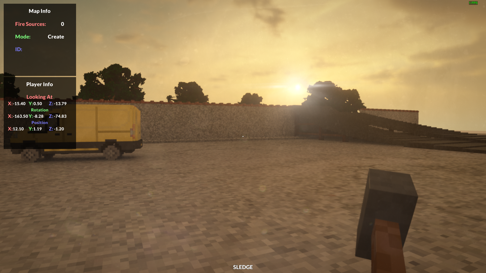
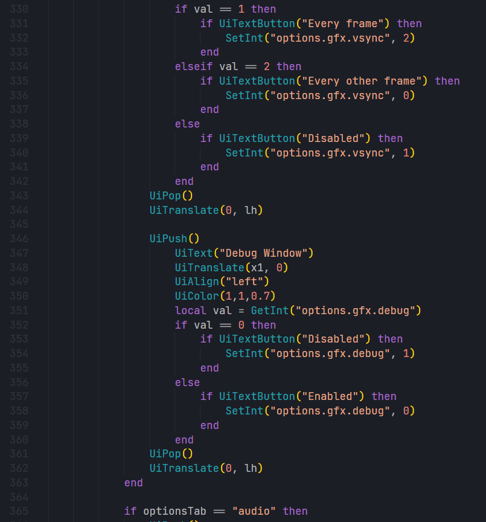

# teardown-debugmenu
Debug menu for Teardown

## Preview



# Instructions

- [How to install](https://github.com/funlennysub/teardown-debugmenu#how-to-install)
- [How to merge it with other mods](https://github.com/funlennysub/teardown-debugmenu#how-to-merge-it-with-other-mods)

## How to install

**IF YOU ALREADY HAVE MODS THAT MAKES CHANGED TO THE `hud.lua` and `options.lua` READ [How to merge it with other mods](https://github.com/funlennysub/teardown-debugmenu#how-to-merge-it-with-other-mods).**

1. Download .zip file
* To download .zip file: Press the green "code" button, then "Download ZIP"
2. Open the folder where the game was installed
3. Go to `data/ui/`
4. Move these 3 **.lua** files that you downloaded and overwrite the existing ones

## How to merge it with other mods

1. Replace the `debug.lua` with the one you downloaded
### Merging `hud.lua`
1. Open the original `hud.lua` file
2. Add `#include "debug.lua"` on top of the file
3. Find the line that says
```lua
function draw()
```
and add `DebugMenuUI()` on the next line
### Merging `options.lua`
1. Open the original `options.lua` file
2. Find vsync settings and after `UiTranslate(0, lh)` add
```lua
UiPush()
    UiText("Debug Window")
    UiTranslate(x1, 0)
	UiAlign("left")
	UiColor(1,1,0.7)
	local val = GetInt("options.gfx.debug")
	if val == 0 then
	    if UiTextButton("Disabled") then
	        SetInt("options.gfx.debug", 1)
		end
	else
	    if UiTextButton("Enabled") then
	        SetInt("options.gfx.debug", 0)
		end
	end
UiPop()
UiTranslate(0, lh)
```
And your code should look something like this:


